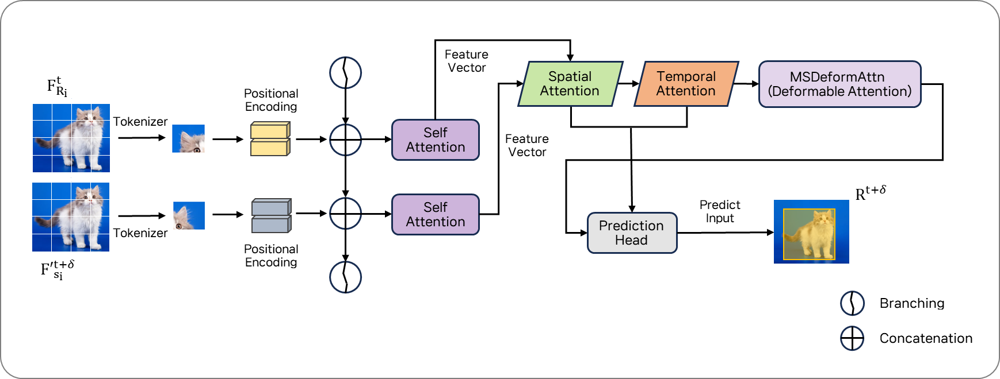
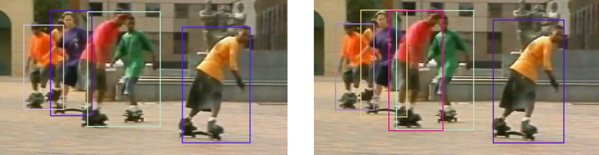

# ST-TrackFormer: Multiple Object Tracking Performance Improvement Using Spatial-Temporal Attention

**[Journal of Korea Multimedia Society, Vol. 27, No. 11, November 2024]**

> Se-Eun Lee, Se-Hoon Jung, Chun-Bo Sim
> Sunchon National University

This repository provides the official implementation of **ST-TrackFormer**, which extends **[TrackFormer](https://github.com/timmeinhardt/trackformer)** (Meinhardt et al., CVPR 2022) by integrating Spatial Attention and Temporal Attention modules into the Transformer encoder-decoder architecture for improved Multi-Object Tracking (MOT) performance.

<div align="center">
    
    
</div>

---

## Overview

ST-TrackFormer is built on top of TrackFormer and introduces two attention mechanisms to better capture spatial relationships between objects within a frame and temporal consistency across consecutive frames:

- **Spatial Attention** — applied in the Transformer encoder to model spatial relationships between objects within each frame
- **Temporal Attention** — applied in both the Transformer encoder and decoder to maintain temporal consistency across frames

<div align="center">
    
</div>

**Key improvements over TrackFormer (MOT17 training set):**

| Method | Recall | MOTA | IDF1 |
| :---: | :---: | :---: | :---: |
| TrackFormer | 70.5 | 67.7 | 68.2 |
| **ST-TrackFormer (Ours)** | **71.5** | **68.5** | **69.1** |

---

## Contents

- [Installation](#installation)
- [Data Preparation](#data-preparation)
- [Pretrained Models](#pretrained-models)
- [Training](#training)
- [Evaluation](#evaluation)
- [Results](#results)
- [Citation](#citation)

---

## Installation

1. Clone this repository:
    ```bash
    git clone git@github.com:se2un/ST-TrackFormer.git
    cd ST-TrackFormer
    ```

2. Install Python dependencies:
    ```bash
    pip install -r requirements.txt
    ```

3. Install PyTorch 1.8+ and torchvision from [pytorch.org](https://pytorch.org/get-started/previous-versions/).

4. Install pycocotools:
    ```bash
    pip install -U 'git+https://github.com/timmeinhardt/cocoapi.git#subdirectory=PythonAPI'
    ```

5. Build the MultiScaleDeformableAttention CUDA operator:
    ```bash
    python src/trackformer/models/ops/setup.py build --build-base=src/trackformer/models/ops/ install
    ```

---

## Data Preparation

Download and place datasets under the `data/` directory.

### MOT17 (required)
```bash
cd data
wget https://motchallenge.net/data/MOT17.zip
unzip MOT17.zip
cd ..
python src/generate_coco_from_mot.py
```

### MOT16 (optional)
```bash
cd data
wget https://motchallenge.net/data/MOT16.zip
unzip MOT16.zip
cd ..
python src/generate_coco_from_mot.py --mot16
```

### MOT20 (optional)
```bash
cd data
wget https://motchallenge.net/data/MOT20.zip
unzip MOT20.zip
cd ..
python src/generate_coco_from_mot.py --mot20
```

The expected final `data/` structure:
```
data/
├── MOT17/
│   ├── train/
│   ├── test/
│   └── annotations/
├── MOT16/          (optional)
└── MOT20/          (optional)
```

---

## Pretrained Models

Download the base Deformable DETR pretrained model (required to initialize training):
```bash
cd models
wget https://vision.in.tum.de/webshare/u/meinhard/trackformer_models_v1.zip
unzip trackformer_models_v1.zip
```

This extracts `r50_deformable_detr_plus_iterative_bbox_refinement-checkpoint_hidden_dim_288.pth`, which is used as the starting checkpoint for MOT17 training.

> **Note:** Our ST-TrackFormer trained checkpoints are not included in this repository due to file size. They will be provided upon request.

---

## Training

ST-TrackFormer is trained directly on MOT17, initialized from the base Deformable DETR checkpoint above.

### MOT17 Training
```bash
torchrun --nproc_per_node=4 --use_env src/train.py with \
    mot17 \
    deformable \
    multi_frame \
    tracking \
    full_res \
    output_dir=models/my_model_mot17
```

Training configuration is defined in `cfgs/train_mot17.yaml` and `cfgs/train_full_res.yaml`. Key hyperparameters:

| Parameter | Value |
| :--- | :--- |
| Backbone | ResNet-50 |
| Hidden dim | 288 |
| Batch size | 1 (×4 GPUs) |
| Epochs | 50 |
| Learning rate | 2e-4 |
| LR drop | 10 |
| Image max size | 650 |

---

## Evaluation

Evaluate on the MOT17 training set (second-half cross-validation):
```bash
python src/track.py with \
    obj_detect_checkpoint_file=models/my_model_mot17/checkpoint_best_MOTA.pth \
    dataset_name=MOT17-TRAIN-FRCNN \
    output_dir=models/my_model_mot17/track_eval_half \
    frame_range.start=0.5 \
    frame_range.end=1.0
```

Evaluate on the full MOT17 training set:
```bash
python src/track.py with \
    obj_detect_checkpoint_file=models/my_model_mot17/checkpoint_best_MOTA.pth \
    dataset_name=MOT17-TRAIN-FRCNN \
    output_dir=models/my_model_mot17/track_eval
```

Tracking configuration can be adjusted in `cfgs/track.yaml`.

---

## Results

> All results are reported on the **training set** of each benchmark using second-half cross-validation (`frame_range: 0.5–1.0`), following the standard protocol used in TrackFormer. No test server submissions are included.

### MOT16

| Method | Recall | MT | PT | FN | MOTA | IDF1 |
| :---: | :---: | :---: | :---: | :---: | :---: | :---: |
| TrackFormer | 74.3 | **50.0** | 49.79 | 50.72 | 71.4 | **78.1** |
| **ST-TrackFormer** | **75.1** | **50.0** | **50.21** | **49.28** | **72.4** | 77.7 |

### MOT17

| Method | Recall | MT | PT | FN | MOTA | IDF1 |
| :---: | :---: | :---: | :---: | :---: | :---: | :---: |
| TrackFormer | 70.5 | 49.19 | 49.81 | 50.88 | 67.7 | 68.2 |
| **ST-TrackFormer** | **71.5** | **50.81** | **50.19** | **49.12** | **68.5** | **69.1** |

### MOT20

| Method | Recall | MT | PT | FN | MOTA | IDF1 |
| :---: | :---: | :---: | :---: | :---: | :---: | :---: |
| TrackFormer | 78.5 | 48.62 | 51.59 | 52.10 | 76.7 | 70.5 |
| **ST-TrackFormer** | **80.2** | **51.38** | **48.41** | **47.90** | **78.2** | **71.8** |

### Ablation Study (MOT17)

Comparison of different Spatial-Temporal Attention combinations:

| Case | Encoder SA | Encoder TA | Decoder SA | Decoder TA | MOTA | IDF1 |
| :---: | :---: | :---: | :---: | :---: | :---: | :---: |
| **1 (Proposed)** | ✓ | ✓ | - | ✓ | **68.5** | **69.1** |
| 2 | ✓ | - | - | ✓ | 67.3 | 68.0 |
| 3 | - | ✓ | - | ✓ | 67.7 | 67.5 |
| 4 | ✓ | ✓ | - | - | 67.7 | 68.9 |
| 5 | ✓ | - | - | - | 67.3 | 68.0 |
| 6 | - | ✓ | - | - | 67.6 | **69.8** |
| 7 | - | - | - | ✓ | 68.0 | 69.5 |
| 8 | - | - | - | - | 67.7 | 68.2 |

### Qualitative Results

The left image shows tracking results from TrackFormer, and the right image shows results from ST-TrackFormer on the MOT16 benchmark. ST-TrackFormer produces more accurate and consistent bounding boxes.

<div align="center">
    
</div>

---

## Citation

If you use ST-TrackFormer in your research, please cite our paper:

```bibtex
@article{lee2024sttrackformer,
    title={ST-TrackFormer: Multiple Object Tracking Performance Improvement Using Spatial-Temporal Attention},
    author={Se-Eun Lee and Se-Hoon Jung and Chun-Bo Sim},
    journal={Journal of Korea Multimedia Society},
    volume={27},
    number={11},
    pages={1227--1237},
    year={2024},
    doi={10.9717/kmms.2024.27.11.1227}
}
```

This codebase builds upon [TrackFormer](https://github.com/timmeinhardt/trackformer). Please also cite the original work:

```bibtex
@InProceedings{meinhardt2021trackformer,
    title={TrackFormer: Multi-Object Tracking with Transformers},
    author={Tim Meinhardt and Alexander Kirillov and Laura Leal-Taixe and Christoph Feichtenhofer},
    booktitle={CVPR},
    year={2022}
}
```

---

## Acknowledgements

This work was supported by the National Research Foundation of Korea (NRF) grant funded by the Korea government (MSIT) (No. RS-2024-00407739) and by the Institute of Information & Communications Technology Planning & Evaluation (IITP) grant funded by the Korea government (MSIT) (IITP-2024-2020-0-01489).
